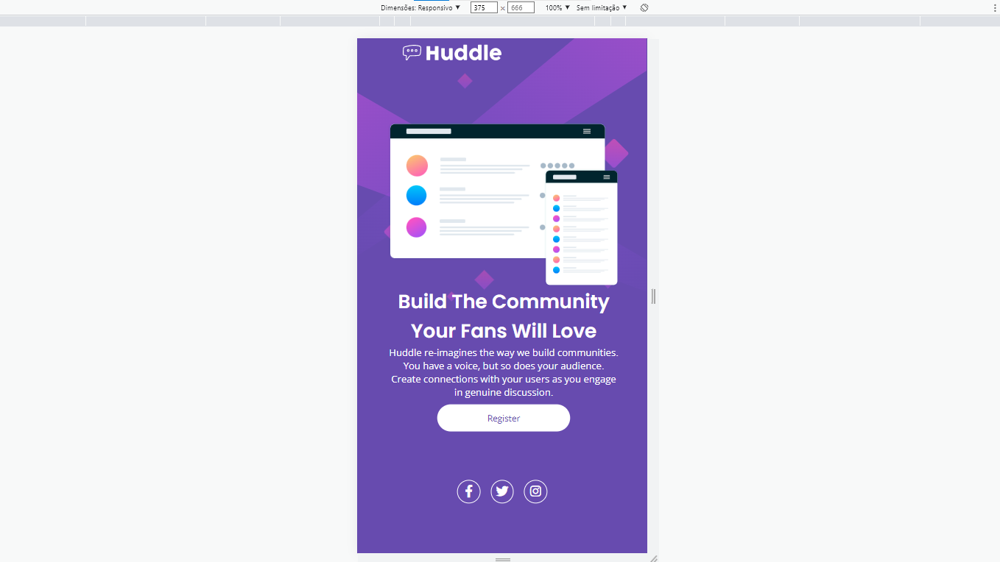

# Frontend Mentor - Huddle landing page with single introductory section

## Bem-vindos

Meu primeiro desafio Frontend Mentor, minha solução para: [Huddle landing page with single introductory section challenge on Frontend Mentor](https://www.frontendmentor.io/challenges/huddle-landing-page-with-a-single-introductory-section-B_2Wvxgi0). O Frontend Mentor oferece desafios de construção de projetos realistas, para ajudar 
nosso desenvolvimennto das habilidades de codificação.

## Estrutura de pastas

## Layout em estado ativo(fornecido)

## Layout em desktop esperado

[]

## Layout em desktop obtido

[]

## Layout em mobile obtido

[]

## Tecnologias Usadas na construção

- HTML 5
- CSS propriedades personalizadas
- CSS Grid
- Flexbox

## Desenvolvimento Contínuo
Ainda preciso aprimorar o uso do grid e flexbox, mais achei incrível a quantidade de opções, recursos que oferecem.

## Dificuldades que tive
Alinhamentos dentro dos parâmetros esperados.
Criação do HTML de primeira vez, requereu algumas mudanças posteriores.

## Referências

Curso de programação frontend: DevQuest até o módulo HTML/CSS Avançado - Dev em Dobro.

https://developer.mozilla.org/pt-BR/docs/Learn/CSS
https://desenvolvimentoparaweb.com/css/unidades-css-rem-vh-vw-vmin-vmax-ex-ch/
https://www.treinaweb.com.br/blog/comecando-com-svg-no-front-end-parte-1/

## Sobre mim

Formada em Tecnologia de Análise e Desenvolvimentode Sistemas pela Unigran.
Cursando: Programação Front-end DevQuest.

## Mensagem Final

"É fazendo que se aprende a fazer aquilo que se deve aprender" Aristóteles.

2023-05-19
